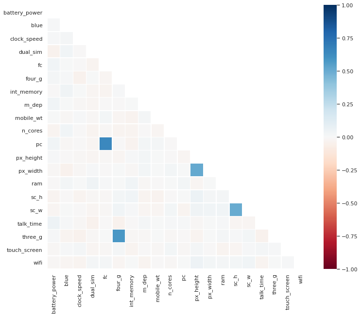
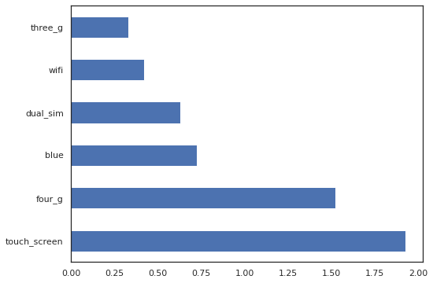
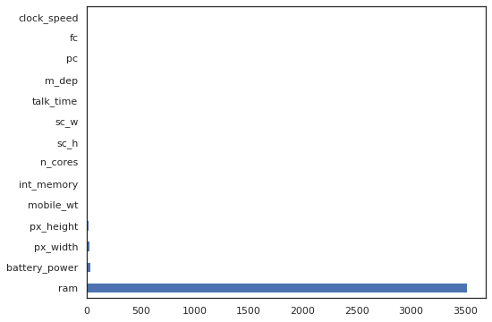
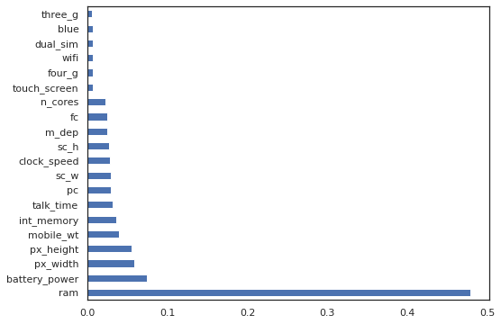
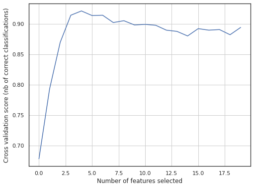

# Mobile Price Prediction
Mobile price prediction project which aims to examine various feature selection methods and train model to observe accuracy improvement.

# Introduction
Kaggle: https://www.kaggle.com/iabhishekofficial/mobile-price-classification

Bob has started his own mobile company. He wants to give tough fight to big companies like Apple,Samsung etc.

He does not know how to estimate price of mobiles his company creates. In this competitive mobile phone market you cannot simply assume things. To solve this problem he collects sales data of mobile phones of various companies.

Bob wants to find out some relation between features of a mobile phone(eg:- RAM,Internal Memory etc) and its selling price. But he is not so good at Machine Learning. So he needs your help to solve this problem.

In this problem you do not have to predict actual price but a price range indicating how high the price is.

# Objective
To examine different feature selection techniques and observe how they will improve classification accuracy. 

In feature selection, the main aim is to select the features which are highly dependent on the response.

Model used throughout the project will be RandomForestClassier with default hyperparameters only.

# Variance Threshold
All features are non-unary

# Correlation Coefficient

If two variables are correlated, we can predict one from the other. Therefore, if two features are correlated, the model only really needs one of them, as the second one does not add additional information

Per Pearson Correlation check, there's no correlation above 0.85. 

<p align="center">
    
</p>

# Chi Square Test (Categorical Features)

A chi-square test is used in statistics to test the independence of two events.

Null Hypothesis (H0): Two variables are independent.

Alternate Hypothesis (H1): Two variables are not independent.

If p-value ≥0.05, failed to reject null hypothesis as there is no relationship between target variable and categorical features.

if p_value <0.05, rejects null hypothesis as there will be some relationship between target variable and categorical features

It is observed that all the 6 categorical features have large p_values, hence we fail to reject the null hypothesis: all of them are independent of the target class, and we will unlikely select them for model training. 

Looking at chi-square statistic scores below in graphical:

<p align="center">
    
</p>

Higher the Chi-Square value, the feature is more dependent on the response and it may be selected for model training.

touch_screen looks most desirable to be selected
three_g is worst.

# ANOVA Test (Continuous Features)

ANOVA is an acronym for “analysis of variance” and is a parametric statistical hypothesis test for determining whether the means from two or more samples of data (often three or more) come from the same distribution or not.

ANOVA is used when one variable is numeric and one is categorical, such as numerical input variables and a classification target variable in a classification task.

<em>credit: https://machinelearningmastery.com/feature-selection-with-numerical-input-data/</em>

<p align="center">
    
</p>

Through ANOVA test on the continuous features, we can see that below are the few features that are very much independent of the target feature.

pc 0.825446

fc 0.772182

clock_speed 0.493708

Also, ram is highest among all of the features. This is one important feature we need to keep in our model training. 


# Feature Importance 

Feature importance is an inbuilt class that comes with Tree Based Classifiers. I have used RandomForestClassier to determine which are the top few features. 

<p align="center">
    
</p>

Ram, battery_power, px_width, px_height, mobile_wt came in top 5. 

# Method 1 - Baseline Model

Kitchen sink method, which included all features. 

Accuracy = 0.90

# Method 2 - Manual Filtering 

Least dependene 3 features per ANOVA test were removed. 

```
['pc', 'fc', 'clock_speed']
```

Accuracy = 0.89

# Method 3 - ANOVA with GridSearchCV for Best K Value

In our search grid, we are specifying value from 1 to 20. We want to know what's the optimal number of features to choose, after running through ANOVA Test. 

It could be just 1 feature, or 2 or even 5 features.

```
grid = dict()
grid['anova__k'] = [i+1 for i in range(len(X.columns))]
gs_model = GridSearchCV(pipeline, grid, scoring='accuracy', n_jobs=-1, cv=cv, verbose=10)
```

We are down to 4 features now

```
['battery_power', 'px_height', 'px_width', 'ram']
```

Accuracy = 0.916

# Method 4 - RFECV

RFE works by searching for a subset of features by starting with all features in the training dataset and successfully removing features until the desired number remains.

As this is a greedy approach by evaluating all the possible combinations of features, it also takes the longest time to implement and execute.

After RFECV, we are down to just 5 features only/

```
['battery_power', 'mobile_wt', 'px_height', 'px_width', 'ram']
```

Accuracy = 0.92

<p align="center">
    
</p>

From the graph, we can also see that model works best with around 4 - 6 features, and deteriorate in accuracy when more features are added. 

# Conclusion

Instead of using all the 20 features for model training, we could actually only use 4 - 6 features which yield better results.

With model tuning in future enhancement, our results could even be better.

For full analysis, please visit https://github.com/chekwei4/Mobile_Price/blob/main/Mobile_Phone_Prediction.ipynb